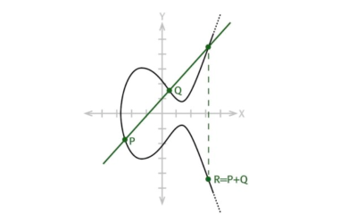

# Комп'ютерний практикум #1: Реалізація арифметики на еліптичних кривих

## Мета лабораторної роботи
Отримання практичних навичок програмної реалізації арфиметики на еліптичних кривих, закріплення
теоретичного матеріалу, отриманого на лекційних заняттях.

## Теоретичний матеріал

### Еліптичні криві
Еліптичні криві &ndash; надзвичайно цікаві математичні об'єкти, що
зв'язують дуже багато різних областей математики, зокрема 
алгебраїчну геометрію, теорію чисел, теорію модулярних форм, 
теорію решіток, комплексний аналіз та криптографію. 
Наведемо дещо спрощене визначення еліптичної кривої, що цілком
достатнє для застосування в криптографії:

*Еліптична крива* над полем $K$ характеристики, відмінної від 2 та 3 &ndash; геометричне місце точок $(x, y) \in (\overline{K})^2$ афінної площини, координати яких взяті із алгебраїчного замикання $\overline{K}$ поля $K$ -  та задовольняють наступному рівнянню (Вейєрштраса):
$$y^2 = x^3 + ax + b;\quad a, b \in K,\quad 4a^3 + 27b^2 \neq 0, $$
плюс точка на нескінченності $O_E$.

Якщо ж $char\ K = 2$, то несуперсингулярні криві будуть задаватись
рівнянням:

$$y^2 + xy = x^3 + ax^2 + b,\quad b  \neq 0.$$

Зазначимо, що дане представлення еліптичної кривої не є єдиним. Розглянемо декілька таких представлень &ndash; форму *Едвардса* та форму *Монтгомері*. 

Кожну еліптичну криву можна представити в формі Монтгомері:
$$By^2 = x^3 + Ax^2 + x;\quad A,B \in K,\quad B(A^2-4) \neq 0,$$

а також в формі Едвардса:

$$ax^2 + y^2 = 1+ dx^2y^2,\quad a \neq d,\ a\neq 0,\ d\neq 0.$$

Надалі в лабораторній роботі нами розглядатись будуть криві в формі
Вейєрштраса над скінченим полем $F_q$, де $q$ &ndash; просте число, відмінне від 2 і 3. 

Точки еліптичної кривої разом з точкою на нескінченності $O_E$ утворюють абелеву групу за операцією додавання точок $\oplus$:

Нехай $P=(x_1, y_1), Q=(x_2, y_2)$ &ndash; точки, відмінні від $O_E$, тоді
- $\forall P \in E: P+O_E=O_E+P=P;$
- якщо $x_1=x_2,\ y_1=-y_2$, то $P\oplus Q=O_E;$
- інакше координати точки $P \oplus Q = R=(x_3, y_3)$: 

```math
\begin{align}
    & x_3 = λ^2 − x_1 − x_2,\\ 
    & y_3 = − y_1 + λ(x_1-x_3),\\ 
    & \lambda = 
    \begin{cases}
        \dfrac{3x_1^2+a}{2y_1},    & \quad \text{якщо } P_1=P_2, \\
        \dfrac{y_2-y_1}{x_2-x_1},  & \quad \text{якщо } P_1\neq P_2.
    \end{cases}
\end{align}
```



*Порядком еліптичної кривої над скінченим полем K* ми називаємо кількість $K$-раціональних точок кривої, тобто точок, які мають координати із поля $K$ плюс точка на нескінченності.

Для обчислення порядку кривої існує ряд поліноміальних алгоритмів, зокрема, алгоритм  Скуфа та алгоритм SEA, проте на них ми зупинятися не будемо. У класичній криптографії на еліптичних кривих прийнято користуватись кривими, порядки який мають вигляд $n=kp$, де $k$ &ndash; мале число, а $p$ &ndash; велике просте, при цьому $n$ має відповідати нерівності Гассе:
$$|n - (q + 1)| \leq 2\sqrt{q},$$
де $q$ &ndash; кількість елементів поля $K$.


### Проективні координати

Проективний простір розмірності $n$ над полем $K$ &ndash; це фактор-множина: 
```math
\mathbb{P}_n = \{(x_0, x_1, ..., x_n)| x_i \in \overline{K}, i=0..n \}/\sim,\\
(x_0, x_1, ..., x_n) \sim (y_0, y_1, ..., y_n) \Leftrightarrow \exists \lambda: \forall i=0..n: y_i = \lambda x_i.
```

Для пришвидшення обчислень досить часто використовують проективні координати замість афінних, що ми ввели на початку. Кожна еліптична крива, задана р-нням Вейєрштраса над полем $K$, може бути представлена в проективних координатах, тобто як геометричне місце точок на проективній площині;
$$Y^2Z = X^3 + aXZ^2 + bZ^3,$$
і при чому кожна точка проективної площини $(X, Y, Z)$ відповідає точці $(X/Z, Y/Z)$ афінної площини. Точка на нескінченності буде мати цілком матеріальне вираження на проективній площині: $O_E=(0, 1, 0)$.

Наведемо псевдокод алгоритмів подвоєння та додавання точок в проективних координатах:

```
const POINT_AT_INFINITY = Point(0, 1, 0)

procedure PointDouble(Point(X, Y, Z)): Point(X', Y', Z')
begin
    # подвоєння точки на нескінченності дасть її ж
    if Point(X, Y, Z) == POINT_AT_INFINITY then
        return POINT_AT_INFINITY
    
    # а тут подвоєння точки другого порядку теж дасть O_E
    if Y == 0 then
        return POINT_AT_INFINITY
    
    W := a*Z^2 + 3*X^2
    S := Y*Z
    B := X*Y*S
    H := W^2 - 8*B
    X' := 2*H*S
    Y' := W*(4*B - H) - 8*Y^2*S^2
    Z' := 8*S^3
    return Point(X', Y', Z')
end.

procedure PointAdd(Point(X1, Y1, Z1), Point(X2, Y2, Z2)): Point(X3, Y3, Z3)
begin
    # обробка випадків точок на нескінченності
    if Point(X1, Y1, Z1) == POINT_AT_INFINITY then
        return Point(X2, Y2, Z2)
    else if Point(X2, Y2, Z2) == POINT_AT_INFINITY then
        return Point(X1, Y1, Z1)

    # тут вхідні точки не співпадають з точками на нескінченності
    U1 := Y2*Z1
    U2 := Y1*Z2
    V1 := X2*Z1
    V2 := X1*Z2
    if V1 == V2
        if U1 != U2 then # тут додавання взаємо-обернених точок
            return POINT_AT_INFINITY
        else # тут вхідні точки однакові
            return PointDouble(X1, Y1, Z1)
    U := U1 - U2
    V := V1 - V2
    W := Z1*Z2
    A := U^2*W - V^3 - 2*V^2*V2
    X3 := V*A
    Y3 := U*(V^2*V2 - A) - V^3*U2
    Z3 := V^3*W
    return Point(X3, Y3, Z3)
end.
```

### Скалярний добуток

У класичній криптографії на еліптичних кривих ключову роль односторонньої функції, на якій базується стійкісь криптосистеми грає *скалярний добуток*.

Скалярним добутком точки $P$ на невід'мне $k$ ми називаємо точку: 
$$Q = kP = \underset{k\ \text{разів}}{P \oplus P \oplus \dots \oplus P}.$$ 
Обернена задача знаходження дискретного логарифму(*ECDLP*) полягає в тому, щоб маючи точки $Q, P$ знайти невідоме $k$. Ця задача є надзвичайно складною в класичній моделі обчислень. Найкращі на сьогоднішній день алгоритми (*Pollard Rho, NFS, Pohlig–Hellman*) мають все ще експоненційну складність.

Простий алгоритм для скалярного добутку, який носить назву *DoubleAndAdd*, має такий вид:
```
procedure ScalarMultiplication(Point(X, Y, Z), k): Point(X', Y', Z')
begin
    bits := bit_representation(k) # бітове предствалення k
    res := POINT_AT_INFINITY
    temp := Point(X, Y, Z)
    for i from 0 to len(bits)-1 do 
        if bits[i] == 1 then            
           res := PointAdd(res, temp)
        temp := PointDouble(temp)
   return res
end.
```
У криптографічних застосуваннях як правило використовують алгоритми, що мають константний час виконання. Тому досить часто використовують алгоритм *сходи Монтгомері*:
```
procedure ScalarMultiplicationMontgomery(Point(X, Y, Z), k): Point(X', Y', Z')
begin
    R0 := POINT_AT_INFINITY
    R1 := Point(X, Y, Z)
    bits := bit_representation(k)
    for i from len(bits)-1 downto 0 do # зворотня індексація
        if bits[i] == 0 then
            R1 := PointAdd(R0, R1)
            R0 := PointDouble(R0)
        else
            R0 := PointAdd(R0, R1)
            R1 := PointDouble(R1)
    return R0
end.
```

## Завдання
1. Реалізувати зручною мовою програмування бібліотеку функцій та типів для роботи з еліптичними кривими: тип даних "Еліптична крива", тип даних "Точка еліптичної кривої" у афінних та проективних координатах, функції перевірки належності точки до кривої, додавання точок, подвоєння, скалярний добуток (можна одним із описаних вище алгоритмів), функції взаємного перетворення точки між афінними та проективними координатами. Функції арифметики необхідно реалізовувати в проективних координатах (реалізувати афінні вам теж ніхто не забороняє, хоча би відчуєте разючу різницю в швидкодії :)).

2. Реалізувати тестову програму, що застосовує написані в п.1 функції для реалізації арифметики над еліптичними кривими заданими згідно варіанту (всі наведені еліптичні криві описано у стандартах *ECDSA*[7]), *EdDSA*[8], *Baby Jubjub*[9]:

| Варіант      | Еліптична крива |
| ----------- | ----------- |
| 1   | P-192       |
| 2   | P-224       |
| 3   | P-256       |
| 4   | P-384       |
| 5   | P-519       |
| 6 `*`  | [Ed25519](https://datatracker.ietf.org/doc/html/rfc8032)     |
| 7 `*`  | [BabyJubJub](https://docs.iden3.io/publications/pdfs/Baby-Jubjub.pdf)  |

3. Перевірити коректність вашої реалізації арифметики: згенерувати випадкову точку $P \neq O_E$ та перевірити, що виконується рівність $nP=O_E$, де $n$ - порядок кривої вашого варіанту. 

4. `*` Обчислити кількість $F_p$-раціональних точок еліптичної кривої за допомогою алгоритму [Скуфа](https://math.mit.edu/classes/18.783/2021/LectureNotes8.pdf)

> `*` означає додаткові завдання, які не обов'язкові до виконання, але можуть принести додаткові бали до рейтингу

## Рекомендована література
1. Д. Кнут. Искусство программирования на ЭВМ. Т.2. – М.:Мир, 1976. –724 с.
2. Peter L. Montgomery. Speeding the Pollard and elliptic curve methods of factorization. Mathematics of Computation, 48(177):243–264, January 1987.
3. Silverman, J.H. The Arithmetic of Elliptic Curves. Springer New York, 2009
4. https://crypto.stanford.edu/pbc/notes/elliptic/
5. https://citeseerx.ist.psu.edu/viewdoc/download?doi=10.1.1.202.2977&rep=rep1&type=pdf
6. https://nvlpubs.nist.gov/nistpubs/fips/nist.fips.186-4.pdf
7. https://www.cs.miami.edu/home/burt/learning/Csc609.142/ecdsa-cert.pdf
8. https://datatracker.ietf.org/doc/html/rfc8032
9. https://docs.iden3.io/publications/pdfs/Baby-Jubjub.pdf
10. https://math.mit.edu/classes/18.783/2021/LectureNotes8.pdf